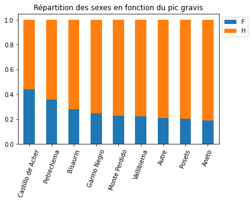
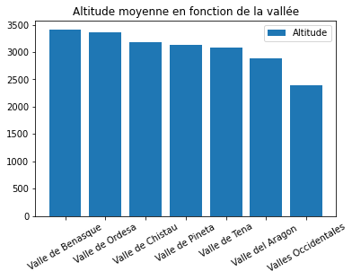
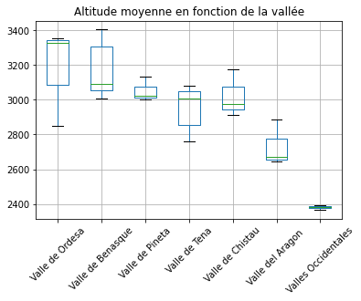

<p align="center">
    
</p>
<div align="center">
    <h2>Fonctions Python</h2>
</div>

<div align="center">
    <h3><u>Les nombres premiers</u></h3>
</div>

### `nbpremier`
> Cette fonction retourne True si le nombre passé en paramètre `n` est un nombre premier sinon False.
> Pour l'utiliser il faut importer la bibliothèque `math` sinon `floor` et `sqrt` ne fonctionneront pas.

```py
import math

def nbpremier (n):
    for i in range(2, floor(sqrt(n)+1)):
        if n % i == 0:
            return False
    return True
````

### Exemple d'appel
```py
print (nbpremier(8))
```

### Programme principal
> Retourne 'n est premier' si le nombre passé en paramètre est premier sinon 'n n'est pas premier'
```py
n = int(input("Saisir un entier supérieur ou égal à  2 : "))
if nbpremier(n)==True :
    print("n est premier")
else :
    print("n n'est pas premier  :")
```

### `eratosthene`
> Affiche sous forme de liste les nombres premiers jusqu'à `n`

```py
def eratosthene(n):
    Liste=[]
    for i in range (2,n+1):
        if nbpremier(i) :
            Liste.append(i)
    return Liste
```

### Exemple d'appel
```py
print (eratosthene(10))
```

### Programme principal
```py
n=int(input("Saisir un entier supérieur ou égal à  2 : "))
print("Liste des nombres premiers inférieurs ou égaux à n : ",eratosthene(n))
print("il y a " ,len(eratosthene(n)), " nombres premiers inférieurs ou égaux à n ")
```

### `decomposition`
> Retourne la liste de tous les facteurs premiers de la decomposition de `n`

```py
def decomposition (n):
    listediv=[]
    for i in range (2, n+1):
        while n%i==0:
            listediv.append(i)
            n=n/i
    return listediv
```

### Exemple d'appel
```py
print (decomposition(20))
```

### Programme principal
```py
n= int (input("Saisir un entier superieur ou egal a 2 : "))
print ("Liste des facteurs premiers de la decomposition de n :", decomposition(n))
```

<div align="center">
    <h3><u>Les matrices</u></h3>
</div>

### `ligne`
> Retourne la ligne i de la matrice `M` passée en paramètre

```py
def ligne (M,i):
    liste=[]
    for j in range (len(M)):
        liste.append(M[i][j])
    return(liste)
```

### Exemple d'appel
```py
M = [[1,2],[3,4],[5,6],[7,8]]

print (ligne(M,1))
```

### Programme principal
```py
n = int (input("Entrer le numero de la ligne a renvoyer : "))
print ("La ligne ", n , " est : ", ligne(M,n-1))
```

### `colonne`
> Retourne le colonne j de la matrice `M` passée en paramètre

```py
def colonne (M,j):
    liste=[]
    for i in range (len(M)):
        liste.append(M[i][j])
    return(liste)
```

### Exemple d'appel
```py
M = [[1,2],[3,4],[5,6],[7,8]]

print (colonne(M,0))
```

### Programme principal
```py
n = int (input("Entrer le numero de la colonne a renvoyer : "))
print ("La ligne ", n , " est : ", colonne(M,n-1))
```

### `parcourir`
> Retourne la matrice `M` sous forme de liste

```py
def parcourir (M):
    liste=[]
    for i in range (len(M)):
        for j in range (2):
            liste.append(M[i][j])
    return(liste)
```

### Exemple d'appel
```py
print (parcourir(M))
```

### `mult`
> Multiplie un matrice `M` par un entier `x` et retourne le résultat sous forme de liste

```py
def mult (M,x):
    liste=[]
    for i in range (len(M)):
        for j in range (2):
            liste.append((M[i][j]) * x)
    return(liste)
```

### Exemple d'appel
```py
print (mult(M, 2))
```

### Programme principal
```py
x = int (input("Entrer le nombre par lequel mutiplier la matrice M : "))
print ("La matrice M multipliée par ", x , " est : ", mult(M, x)
```

### `multi_scal`
> Multiplie un matrice `M` par un entier `x` et retourne le résultat sous forme de liste

```py
def multi_scal (M,x):
    liste=[]
    for i in range (len(M)):
        listeInit=[]
        for j in range (2):
            produit = ((M[i][j]) * x)
            listeInit.append(produit)
        liste.append(listeInit)
    return(liste)
```

### Exemple d'appel
```py
print (multi_scal(M, 2))
```

### Programme principal
```py
x = int (input("Entrer le nombre par lequel mutiplier la matrice M : "))
print ("La matrice M multipliée par ", x , " est : ", mult(M, x)
```

### `prod_ligne_col`
> Retourne le produit de la multiplication de la matrice `U` par la matrice `V`

```py
def prod_ligne_col (u,v):
    produit = 0
    for i in range (len(U)):
        produit += ((U[i])*(V[i]))
    return(produit)
```

### Exemple d'appel
```py
U = [4,2,1]
V = [-1,2,3]

print (prod_ligne_col(U,V))
```

### `pgcd`
> Retourne le pgcd des deux nombres `a` et `b` passés en paramètre

```py
def pgcd (a,b):
    while a%b!=0:
        x = a%b
        a = b
        b = x
    return(b)
```

### Exemple d'appel
```py
print(pgcd(9900,594))
```

### Programme principal
```py
x = int (input("Entrer le premier nombre : "))
y = int (input("Entrer le deuxième nombre : "))
print ("Le PGCD de ", x, " et ", y, " est : ", pgdc(x,y))
```

### `pgcd_v2`
> Retourne le pgcd des deux nombres `a` et `b` passés en paramètre

```py
def pgcd_v2 (a,b):
    listea = decomposition(a)
    listeb = decomposition(b)
    liste = []
    for i in range (len(listea)):
        for j in range (len(listeb)):
            if listea[i] == listeb[j]:
                liste.append(listea(i))
                listea.pop(i)
                listeb.pop(j)
                
    return(liste)  
```

### Exemple d'appel
```py
print(pgcd_v2(9900,594))
```

### Programme principal
```py
x = int (input("Entrer le premier nombre : "))
y = int (input("Entrer le deuxième nombre : "))
print ("Le PGCD de ", x, " et ", y, " est : ", pgdc(x,y))
```

### `tab_add`
> Affiche la table d'addition de `n`

```py
def tab_add(n):
    add = []
    for i in range (n):
        add.append([])
        for j in range (n):
            add[i].append((i+j)%n)
    df = pd.DataFrame(add, columns=[i for i in range (n)], index = [i for i in range (n)])
    return (df)
```

### Exemple d'appel
```py
print (tab_add(10))
```

### Programme principal
```py
x = int (input("Entrer la table d'addition que vous voulez afficher : "))
print ("La table d'addition de ", x, " est ", tab_add(10))
```

### `tab_mult`
> Affiche la table de multiplication de `n`

```py
def tab_mult(n):
    mult = []
    for i in range (n):
        mult.append([])
        for j in range (n):
            mult[i].append((i*j))
    df = pd.DataFrame(mult, columns=[i for i in range (n)], index = [i for i in range (n)])
    return (df)
```

### Exemple d'appel
```py
print (tab_mult(10))
```

### Programme principal
```py
x = int (input("Entrer la table de mulitplication que vous voulez afficher : "))
print ("La table de multiplication de ", x, " est ", tab_mult(10))
```

<div align="center">
    <h3><u>Les graphes</u></div>
</div>

### `succ`
> Retourne les successeurs du sommet `s` de `Mat`

```py
def succ(M,s): 
    liste_succ=[] 
    for j in range(len(M)): 
        if M[s][j]==1: 
            liste_succ.append(j) 
    return liste_succ 
```

### Exemple d'appel
```py
Mat = [[0,0,1,0,0,1,1],[0,1,0,1,0,0,0],[0,1,0,0,0,1,0],[0,0,1,0,1,0,0],[0,0,0,0,0,1,1],[1,0,0,0,0,0,1],[0,0,0,0,0,0,0]]

succ(Mat,2)
```

### Programme principal
```py
x = int (input("Entrer le sommet dont vous souhaitez voir les successeurs : "))
print ("Les successeurs du sommet ", x, " sont ", succ(Mat,x))
```

### `nb_succ`
> Retourne le nombre de successeurs du sommet `s` de `Mat`

```py
def nb_succ(M,s): 
    nb=0 
    for j in range(len(M)): 
        if M[s][j]==1: 
            nb=nb+1 
    return nb
```

### Exemple d'appel
```py
Mat = [[0,0,1,0,0,1,1],[0,1,0,1,0,0,0],[0,1,0,0,0,1,0],[0,0,1,0,1,0,0],[0,0,0,0,0,1,1],[1,0,0,0,0,0,1],[0,0,0,0,0,0,0]]

nb_succ(Mat,2)
```

### Programme principal
```py
x = int (input("Entrer le sommet dont vous souhaitez voir le nombre de successeurs : "))
print ("Le sommet ", x, " a ", nb_succ(Mat,x), " successeurs")
```

### `pred`
> Retourne les prédecesseurs du sommet `s`de `Mat`

```py
def pred(M,s): 
    liste_pred=[] 
    for i in range(len(M)): 
        if M[i][s]==1: 
            liste_pred.append(i) 
    return liste_pred
```

### Exemple d'appel
```py
Mat = [[0,0,1,0,0,1,1],[0,1,0,1,0,0,0],[0,1,0,0,0,1,0],[0,0,1,0,1,0,0],[0,0,0,0,0,1,1],[1,0,0,0,0,0,1],[0,0,0,0,0,0,0]]

pred(Mat,2)
```

### Programme principal
```py
x = int (input("Entrer le sommet dont vous souhaitez voir les predeccesseurs : "))
print ("Les predeccesseurs du sommet ", x, " sont ", pred(Mat,x))
```

### `nb_pred`
> Retourne le nombre de prédécesseurs du sommet `s`de `Mat`

```py
def nb_pred(M,s): 
    nb=0 
    for i in range(len(M)): 
        if M[i][s]==1: 
            nb=nb+1 
    return nb
```

### Exemple d'appel
```py
Mat = [[0,0,1,0,0,1,1],[0,1,0,1,0,0,0],[0,1,0,0,0,1,0],[0,0,1,0,1,0,0],[0,0,0,0,0,1,1],[1,0,0,0,0,0,1],[0,0,0,0,0,0,0]]

pred(Mat,2)
```

### Programme principal
```py
x = int (input("Entrer le sommet dont vous souhaitez voir le nombre de predeccesseurs : "))
print ("Le sommet ", x, " a ", nb_pred(Mat,x), " predeccesseurs")
```

### `mat`
> Renvoie le matrice d'adjacence de `D` sous forme de liste de liste

```py
def mat(D): 
    m=[[0 for i in range(len(D))]for i in range(len(D))] 
    for cle in D: 
        for val in D[cle] : 
            m[cle][val]=1 
    return m
```

### Exemple d'appel
```py
Mat = [[0,0,1,0,0,1,1],[0,1,0,1,0,0,0],[0,1,0,0,0,1,0],[0,0,1,0,1,0,0],[0,0,0,0,0,1,1],[1,0,0,0,0,0,1],[0,0,0,0,0,0,0]]

mat(M)
```

### `dico`
> Renvoie la matrice d'adjacence de `M` sous forme de dictionnaire

```py
def dico(M): 
    n=len(M) 
    d={} 
    for i in range(n): 
        d[i]=[] 
        for j in range(n): 
            if M [i][j]==1: 
                d[i].append(j) 
    return d
```

### Exemple d'appel
```py
Mat = [[0,0,1,0,0,1,1],[0,1,0,1,0,0,0],[0,1,0,0,0,1,0],[0,0,1,0,1,0,0],[0,0,0,0,0,1,1],[1,0,0,0,0,0,1],[0,0,0,0,0,0,0]]

dico(Mat)
```

### `symetrique`
> Renvoie le graphe symétrique du graphe `D`

```py
def symetrique(D):
    print ("Avant",D)
    k = len(D)
    for i in D:
        for j in D[i]:
            if i not in D[j]:
                    D[j].append(i)
    return D
```

### Exemple d'appel
```py
D = {1:[1,2,3], 2:[3,4], 3:[1], 4:[1,2,4]}

symetrique(D)
```

### `reflexif`
> Renvoie le graphe reflexif du graphe `D`

```py
def reflexif(D):
    print ("Avant",D)
    k = len(D)
    for i in D:
        if i not in D[i]:
            D[i].append(i)
    return D
```

### Exemple d'appel
```py
D = {1:[1,2,3], 2:[3,4], 3:[1], 4:[1,2,4]}

reflexif(D)
```

<div align="center">
    <h3><u>Décomposition en niveau</u></div>
</div>

### `parcours_profondeur`
> Retourne la liste des prédécesseurs de `s0` de la matrice `Mat` en utilisant le parcours en profondeur

```py
def parcours_profondeur(Mat,s0):
    n=len(Mat)
    pred=[None]*n
    vu=[False]*n

    vu[s0]=True
    pile=[s0]

    while pile!=[]:
        s=pile.pop(len(pile)-1)
        for succ in succ(Mat,s):
            if vu[succ]==False:
                vu[succ]=True
                pred[succ]=s
                pile.append(succ)
    return(pred)
```

### Exemple d'appel
```py
Mat = [[0,0,1,0,0,1,1],[0,1,0,1,0,0,0],[0,1,0,0,0,1,0],[0,0,1,0,1,0,0],[0,0,0,0,0,1,1],[1,0,0,0,0,0,1],[0,0,0,0,0,0,0]]

parcours_profondeur(Mat,2)
```

### `parcours_largeur`
> Retourne la liste des prédécesseurs de `s0` de la matrice `Mat` en utilisant le parcours en largeur

```py
def parcours_largeur(Mat,s0):
    n=len(Mat)
    pred=[None]*n
    vu=[False]*n

    vu[s0]=True
    file=[s0]

    while file!=[]:
        s=file.pop(0)
        for succ in succ(Mat,s):
            if vu[succ]==False:
                vu[succ]=True
                pred[succ]=s
                file.append(succ)
    return(pred)
```

### Exemple d'appel
```py
Mat = [[0,0,1,0,0,1,1],[0,1,0,1,0,0,0],[0,1,0,0,0,1,0],[0,0,1,0,1,0,0],[0,0,0,0,0,1,1],[1,0,0,0,0,0,1],[0,0,0,0,0,0,0]]

parcours_largeur(Mat,2)
```

### `decomp_niv`
> Retourne la liste correspondant à la décomposition en niveau de chaque sommet de la matrice `M`

```py
def decomp_niv(M): 
    File=[] 
    Niv=[0]*len(M) 
    NbPred=[0]*len(M) 

    for i in range(len(M)):  
        NbPred[i]=nb_pred(M,i) 
        if NbPred[i]==0 : 
            File.append(i) 

    while File != []:  
        s=File.pop(0) 
        for succ in succ(M,s): 
            NbPred[succ]=NbPred[succ]-1 
            if NbPred[succ]==0 : 
                File.append(succ) 
                Niv[succ]=Niv[s]+1 
    return Niv
```

### Exemple d'appel
```py
Mat = [[0,0,1,0,0,1,1],[0,1,0,1,0,0,0],[0,1,0,0,0,1,0],[0,0,1,0,1,0,0],[0,0,0,0,0,1,1],[1,0,0,0,0,0,1],[0,0,0,0,0,0,0]]

decomp_niv(Mat)
```

<div align="center">
    <h3><u>Exploitation de base de données</u></div>
</div>

### `pyodbc`
> pyodbc est un module Python open source qui simplifie l'accès aux bases de données ODBC

### Requêtes sur une base de données MySQL hebergée sur phpMyAdmin
> Affiche tous les articles de la table Article
```py
conn = pyodbc.connect('DSN=baseDeDonnees')

monCursor = conn.cursor()

SQLCommand = ("select Article.* from Article")
monCursor.execute(SQLCommand)
for row in monCursor.fetchall():
        print(row)
```

> Affiche les articles commençant par la chaîne saisie
```py
filter = input("Entrer le début des descriptifs qui vous intéressent : ")
sql = ("select Article.* from Article where (((Article.Descriptif) like ? and Article.Reference <> ?))")
param = (f'{filter}%', 'B12')
monCursor.execute(sql, param)
for row in monCursor.fetchall():
    print(row)
```

### Graphes à partir de fichiers CSV

#### Répartition des sexes en fonction du pics gravis
```py
Sexe = fic_pic['Sexe']

corresp = {'Aneto' : 'Aneto',
           'Aragüells' : 'Autre',
           'Aspe' : 'Autre',
           'Bachimala' : 'Autre',
           'Bacías' : 'Autre',
           'Bisaurín' : 'Bisaurín',
           'Castillo de Acher' : 'Castillo de Acher',
           'Cilindro' : 'Autre',
           'Collarada' : 'Autre',
           'Cotiella' : 'Autre',
           'Garmo Negro' : 'Garmo Negro',
           'Infiernos' : 'Autre',
           'La Facha' : 'Autre',
           'La Munia' : 'Autre',
           'Monte Perdido' : 'Monte Perdido',
           'Mulleres' : 'Autre',
           'Petrechema' : 'Petrechema',
           'Peña Forca' : 'Autre',
           'Pico de Alba' : 'Autre',
           'Posets' : 'Posets',
           'Punta Escuzana' : 'Autre',
           'Punta Las Olas' : 'Autre',
           'Punta Suelza' : 'Autre',
           'Robiñera' : 'Autre',
           'Tendeñera' : 'Autre',
           'Vallibierna' : 'Vallibierna'
}

fic_pic['pico'] = fic_pic['pico'].map(corresp)

Pico = fic_pic['pico']

SexePico = pd.crosstab(Pico, Sexe, normalize="index")

SexePico.sort_values("F", ascending=False).plot(
    kind="bar",
    stacked=True
)

plt.xticks(rotation=70)
plt.xlabel('')

plt.legend(bbox_to_anchor =(1, 1), ncol = 1)

plt.title("Répartition des sexes en fonction du pic gravis")
```
<div align="center">
    
</div>

#### Altitude moyenne en fonction du sommet (Diagramme en barre)
```py
Vallee = fic_sommets['Zone (Carte)']

df = fic_sommets

Altitude = df.groupby(['Zone (Carte)']).mean()

df_sorted_desc = df.sort_values('Altitude', ascending=False)

plt.bar('Zone (Carte)', 'Altitude',data=df_sorted_desc)

plt.title("Altitude moyenne en fonction de la vallée")

plt.legend(['Altitude'])

plt.xticks(rotation=30)
```
<div align="center">
    
</div>

#### Altitude moyenne en fonction du sommet (Boîte à moustache)
```py
df = fic_sommets

g = df.groupby("Zone (Carte)")

df = pd.DataFrame({col: val['Altitude'] for col, val in g})

median = df.median()

median.sort_values(ascending=False, inplace=True)

df = df[median.index]

df.boxplot()

plt.title("Altitude moyenne en fonction de la vallée")

plt.xticks(rotation=45)

plt.show()
```
<div align="center">
    
</div>